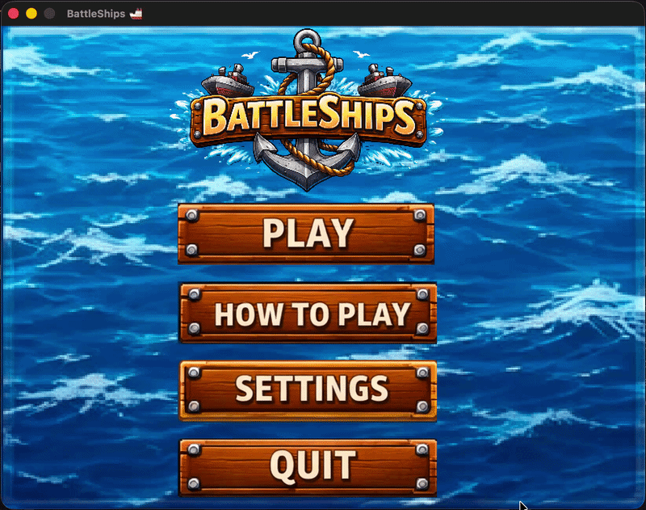

# BattleShips



A modern, graphical take on the classic Battleship game, rebuilt from a terminal prototype into a full 2D desktop game in **Go** using the **Ebiten** game engine.

The project started life as a simple CLI exercise and has evolved into a polished single-player experience with animated UI, configurable match parameters, persistent user settings, and a focus on clean architecture and runtime performance.

---

## Highlights

- **Written from scratch in Go** using [Ebiten v2](https://ebitengine.org/) for rendering, input, and the game loop.
- **Custom UI toolkit** built on top of Ebiten with animated buttons, hover/press feedback, focus rings and keyboard-navigable input fields. All hand-rolled, no UI framework.
- **Sprite sheet pipeline** that slices a single master asset into reusable `*ebiten.Image` regions at load time, minimizing texture binds and disk I/O.
- **Size-aware ship rendering**: 1-cell, 2-cell, and N-cell ships are composed from distinct head / mid / tail sprites and auto-rotated to match the ship's orientation.
- **Dynamic, configurable gameplay**: grid height, grid width, and ship count are all user-configurable at runtime, with live validation against the current board.
- **Persistent settings** written to the OS-native config directory (`$XDG_CONFIG_HOME` / `%APPDATA%` / `~/Library/Application Support`) as JSON so that the user's preferences survive across sessions.
- **Deterministic, bounded ship-placement algorithm** that replaced an unbounded rejection-sampling loop (see [Performance & Reliability](#performance--reliability) below).
- **Clean package layout**: `components/` (domain), `services/` (game orchestration), `main/` (presentation), where each piece is independently testable and the existing CLI logic still compiles cleanly alongside the graphical frontend.
- **Unit tests** for board, ship, and player components.

---

## Gameplay

Six distinct screens, each with its own update/draw path:

| Screen         | Purpose                                                                 |
| -------------- | ----------------------------------------------------------------------- |
| Home           | Animated main menu with Play, How To Play, Settings, Quit buttons       |
| How To Play    | In-game instructions                                                    |
| Settings       | Configure grid size and ship count via mouse **or** keyboard           |
| Game           | Click cells to fire; live turn counter and elapsed-time display         |
| Reveal         | Short cinematic showing the full fleet layout after victory             |
| Result         | Final turns taken and total time                                        |

### Input

- **Mouse**: point-and-click for menus, cells, and +/- controls.
- **Keyboard** (Settings): Tab to cycle fields, Arrow keys to increment/decrement, digits to type exact values, Enter/Esc to commit, Backspace to edit.

---

## Performance & Reliability

Two real-world bugs were identified and fixed during development; both are documented here because they illustrate practical Go + game-engine debugging work.

### 1. Unbounded ship placement → freeze on large fleets

The original placement routine used rejection sampling with a fixed `rand.Intn(256)` domain, regardless of the actual board dimensions. On a 10×10 board the acceptance rate was under 0.2%, and for infeasible configurations (many large ships on a small grid) the loop was **genuinely infinite**, hanging the render thread.

**Fix**: rewrote the algorithm to enumerate every legal `(x, y, orientation)` triple into a reusable scratch slice, then pick one uniformly at random. Worst case is `O(W · H · size)` per ship, and the function now returns cleanly when no legal placement exists instead of spinning.

### 2. Per-frame GPU texture leak on the Settings screen

The focus ring around keyboard-focused input fields was being built from two freshly allocated `ebiten.NewImage` instances **every frame** (~120 GPU textures/second at 60 FPS). Ebiten's image objects are GPU-backed and only freed via finalizer, so the memory climbed steadily the longer a user stayed on Settings and persisted across sessions.

**Fix**: replaced the per-frame allocations with `vector.DrawFilledRect` (zero-alloc), removed dead code doing the same, cleared stale references before starting a new game, and added an explicit `runtime.GC()` hint at game-restart boundaries so transient board/ship/coordinate slices are reclaimed between sessions.

### 3. GC-friendly hot paths

- Reused scratch buffers (candidate placements, rendered-ship snapshots) across games instead of reallocating.
- Cleared the `AllShips` map with `delete` in place rather than replacing it, preserving the underlying hash storage.
- Nil-ed out old board/player references on restart so the garbage collector can reclaim them immediately instead of doubling peak memory during handoff.

---

## Project Structure

```
BattleShips/
├── components/          # Pure domain types (board, player, ship)
│   ├── board/           # Grid representation + status enum
│   ├── ship/            # Ship placement algorithm, rendered-ship snapshot
│   └── player/          # Player stats (attempts, hits)
├── services/
│   └── gameService/     # Orchestrates a match: new game, play turn, reset
└── main/                # Ebiten frontend
    ├── main.go          # Game struct, screen state machine, update/draw
    ├── animations.go    # animatedButton + controlHotspot widgets
    ├── utilities.go     # Config I/O, input handling, helpers
    └── assets/          # Sprites, background art, TTF font
```

---

## Tech Stack

- **Language**: Go 1.26
- **Game engine**: `github.com/hajimehoshi/ebiten/v2`
- **Rendering**: Ebiten `vector` package for shapes, `text/v2` for custom TTF font rendering (Special Elite)
- **Assets**: embedded via `//go:embed` so that the final binary is fully self-contained
- **Persistence**: stdlib `encoding/json` + `os.UserConfigDir`

---

## Build & Run

```bash
git clone https://github.com/ABCoder1/BattleShips.git
cd BattleShips
go run ./main
```

To produce a standalone binary:

```bash
go build -o battleships ./main
./battleships
```

Ebiten supports macOS, Linux, and Windows out of the box. All game assets are embedded, so the resulting binary has no runtime dependencies.

---

## Testing

```bash
go test ./...
```

Covers the board, ship, and player components.

---

## Future Ideas

- Sound effects and background music
- AI opponent with configurable difficulty
- Multiplayer over LAN using Ebiten's network-friendly loop
- WebAssembly build for browser play (as Ebiten supports `GOOS=js GOARCH=wasm` natively)
